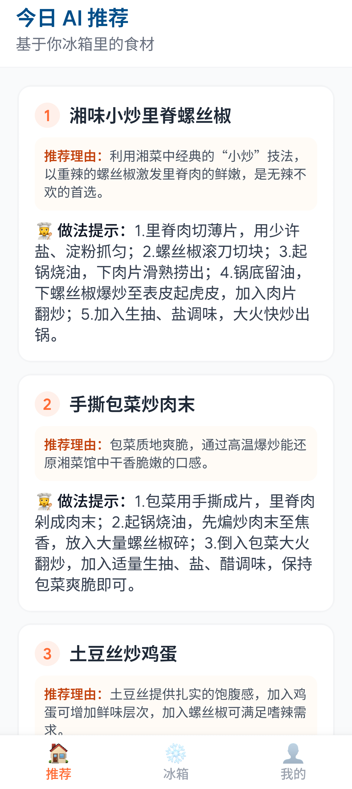
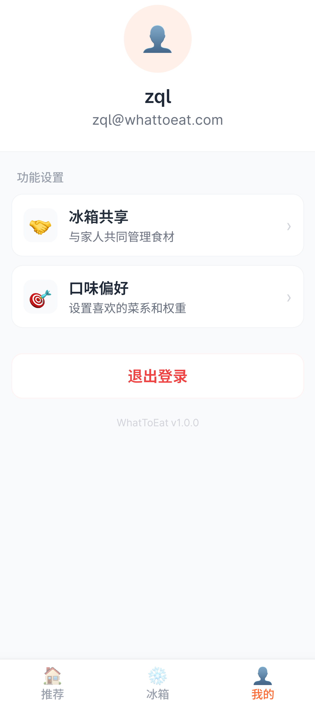
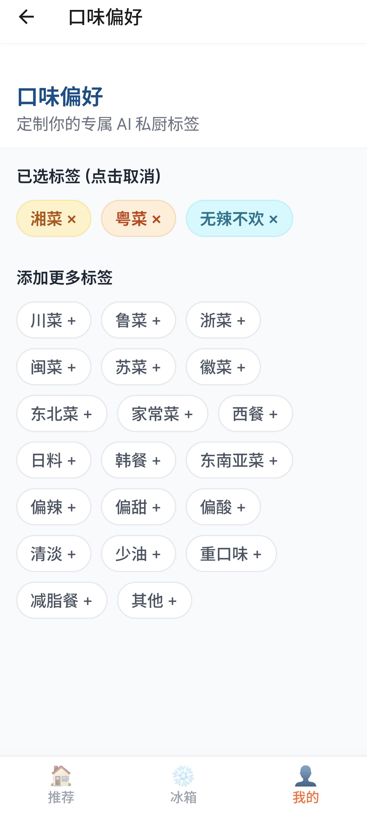

<div align="center">


# WhatToEat - 今天吃什么？

> 基于冰箱食材的 AI 智能菜谱推荐 App，让 AI 私厨帮你解决"今天吃什么"的终极难题。

</div>

## 📖 简介

WhatToEat 是一款全栈移动应用，用户只需记录冰箱里的食材，AI 便会根据现有食材和口味偏好智能推荐菜谱。支持多用户独立账户与菜单共享功能，适合家庭和朋友间分享美食灵感。

## 📸 应用截图

<p align="center">
  
  
  
</p>

## ✨ 功能特性

- **🧊 冰箱管理** — 记录和管理冰箱中的食材，支持数量和保质期备注
- **🤖 AI 智能推荐** — 基于 Gemini API，根据现有食材 + 口味偏好推荐 1~5 道菜，附带推荐理由和做法步骤
- **🎯 口味偏好** — 设置菜系和口味偏好（如川菜、粤菜、日料等），让推荐更合你心意
- **🔗 菜单共享** — 将你的食材清单和推荐结果共享给家人朋友
- **👤 多用户支持** — 独立账户体系，JWT 认证，数据隔离

## 🛠️ 技术栈

### 前端 (mobile/)

| 技术                       | 说明                                     |
| -------------------------- | ---------------------------------------- |
| React Native + Expo SDK 56 | 跨平台移动端框架                         |
| NativeWind v4              | TailwindCSS 风格的 React Native 样式方案 |
| React Navigation           | 底部 Tab 导航 + Stack 导航               |
| Axios                      | HTTP 请求客户端                          |
| AsyncStorage               | 本地持久化存储                           |

### 后端 (server/)

| 技术       | 说明                                  |
| ---------- | ------------------------------------- |
| Go + Gin   | 高性能 HTTP Web 框架                  |
| GORM       | Go ORM 框架，支持 SQLite / PostgreSQL |
| JWT        | 用户认证与授权                        |
| Gemini API | Google AI 大模型，用于智能菜谱推荐    |

### 部署

- **后端**：Railway 云平台自动部署
- **CI/CD**：GitHub Actions

## 📁 项目结构

```
WhatToEat/
├── mobile/                  # React Native 前端
│   ├── src/
│   │   ├── components/      # 可复用 UI 组件
│   │   ├── contexts/        # React Context（AuthContext 认证状态管理）
│   │   ├── navigation/      # 导航配置（底部 Tab + Stack）
│   │   ├── screens/         # 页面组件
│   │   │   ├── HomeScreen       # 首页 - AI 推荐展示
│   │   │   ├── FridgeScreen     # 冰箱食材管理
│   │   │   ├── PreferenceScreen # 口味偏好设置
│   │   │   ├── ShareScreen      # 菜单共享
│   │   │   ├── ProfileScreen    # 个人中心
│   │   │   ├── LoginScreen      # 登录
│   │   │   └── RegisterScreen   # 注册
│   │   └── services/        # API 请求封装
│   ├── App.js               # 应用入口
│   └── package.json
│
├── server/                  # Go 后端
│   ├── main.go              # 服务入口 & 路由注册
│   ├── models/              # 数据模型（User, FridgeItem, UserPreference, SharedMenu）
│   ├── handlers/            # API Handler（auth, fridge, recommend, share）
│   ├── middleware/          # JWT 认证中间件
│   ├── database/            # 数据库初始化 & 连接管理
│   └── .env.example         # 环境变量配置模板
│
└── .github/workflows/       # GitHub Actions CI/CD
```

## 🚀 快速开始

### 环境要求

- **Node.js** >= 18
- **Go** >= 1.21
- **Expo CLI**（`npm install -g expo-cli`）

### 后端启动

```bash
cd server

# 安装依赖
go mod tidy

# 配置环境变量
cp .env.example .env
# 编辑 .env 文件，填入以下必要配置：
# - GEMINI_API_KEY: Google Gemini API 密钥
# - JWT_SECRET: JWT 签名密钥
# - DATABASE_URL: 数据库连接地址（默认使用 SQLite）

# 启动服务（默认端口 8080）
go run main.go
```

### 前端启动

```bash
cd mobile

# 安装依赖
npm install

# 启动开发服务器
npx expo start
```

> **提示**：Android 模拟器中访问本地后端需将 API 地址设为 `http://10.0.2.2:8080`

## 📡 API 接口

### 认证

| 方法 | 路径                 | 说明     |
| ---- | -------------------- | -------- |
| POST | `/api/auth/register` | 用户注册 |
| POST | `/api/auth/login`    | 用户登录 |

### 冰箱管理 (需认证)

| 方法   | 路径              | 说明             |
| ------ | ----------------- | ---------------- |
| GET    | `/api/fridge`     | 获取冰箱食材列表 |
| POST   | `/api/fridge`     | 添加食材         |
| DELETE | `/api/fridge/:id` | 删除食材         |

### 推荐 & 偏好 (需认证)

| 方法   | 路径                        | 说明            |
| ------ | --------------------------- | --------------- |
| GET    | `/api/recommend`            | AI 智能推荐菜品 |
| GET    | `/api/preferences`          | 获取口味偏好    |
| POST   | `/api/preferences`          | 添加口味偏好    |
| DELETE | `/api/preferences/:cuisine` | 删除口味偏好    |

### 共享功能 (需认证)

| 方法   | 路径             | 说明               |
| ------ | ---------------- | ------------------ |
| POST   | `/api/share`     | 共享菜单给其他用户 |
| DELETE | `/api/share/:id` | 取消共享           |
| GET    | `/api/shared`    | 获取共享列表       |

### 健康检查

| 方法 | 路径      | 说明         |
| ---- | --------- | ------------ |
| GET  | `/health` | 服务健康检查 |

## ⚙️ 环境变量

| 变量名           | 说明                                            | 必填 |
| ---------------- | ----------------------------------------------- | ---- |
| `GEMINI_API_KEY` | Google Gemini API 密钥                          | ✅   |
| `LLM_MODEL`      | Gemini 模型名称（默认 `gemini-3.1-flash-lite`） | ❌   |
| `JWT_SECRET`     | JWT 签名密钥                                    | ✅   |
| `DATABASE_URL`   | 数据库连接地址                                  | ❌   |
| `PORT`           | 服务端口（默认 `8080`）                         | ❌   |

## 📄 License

[MIT](mobile/LICENSE)
